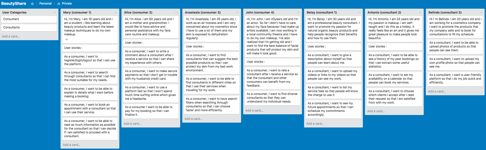
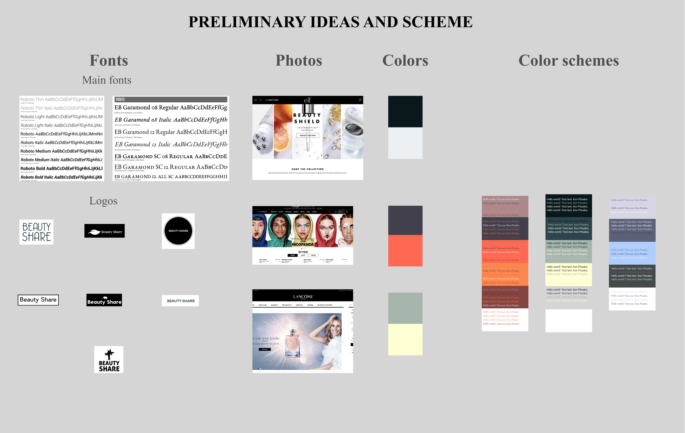
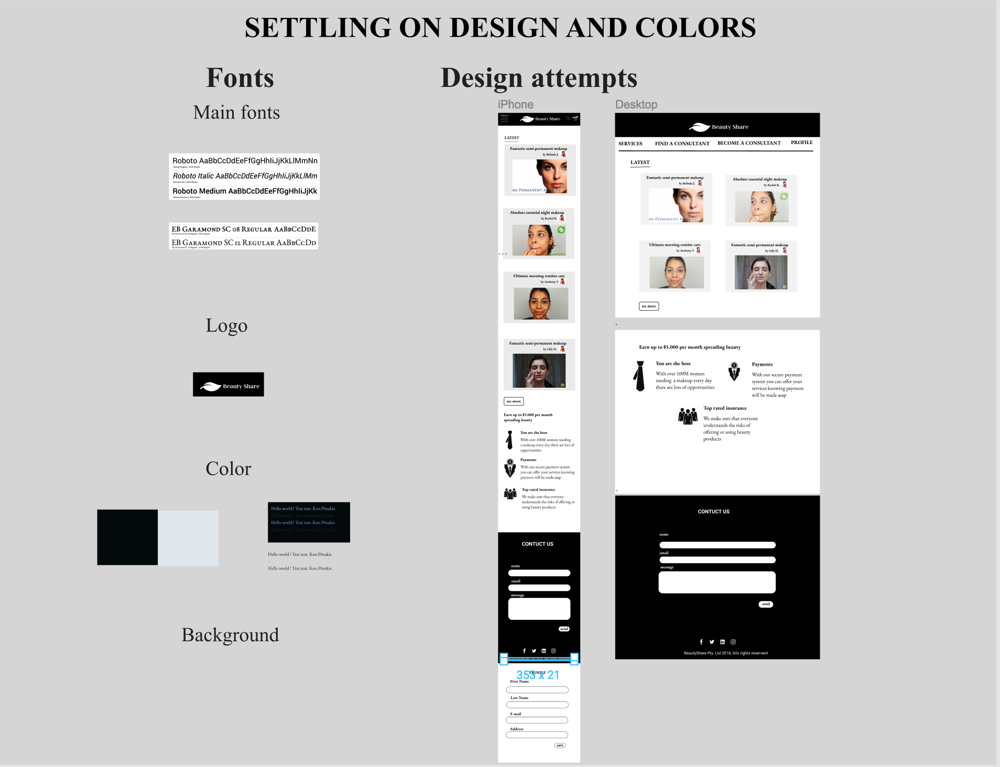
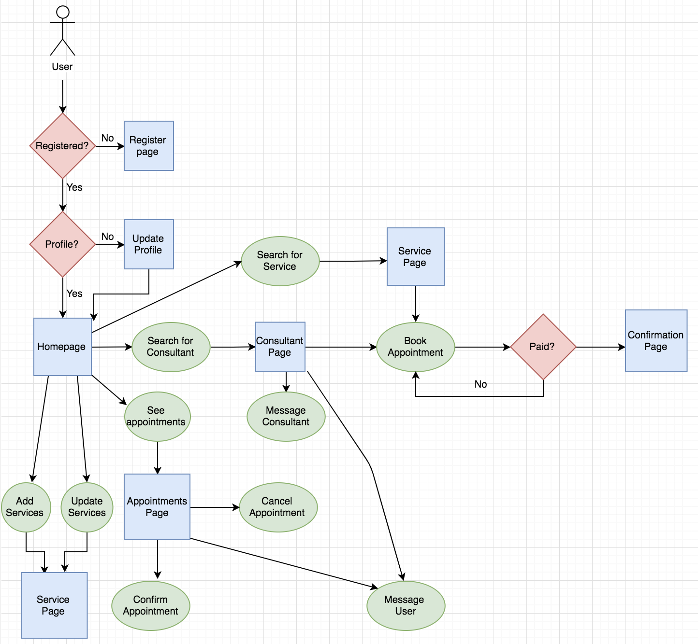
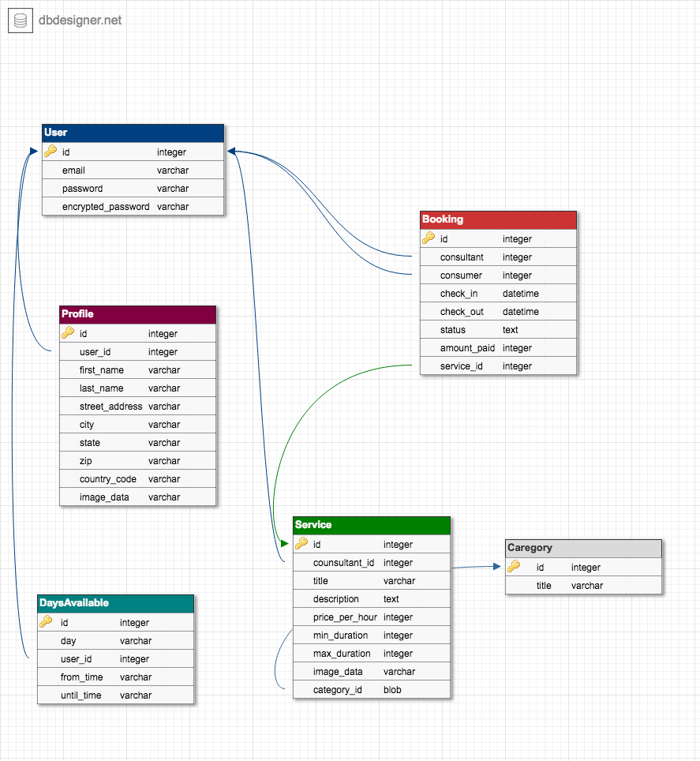
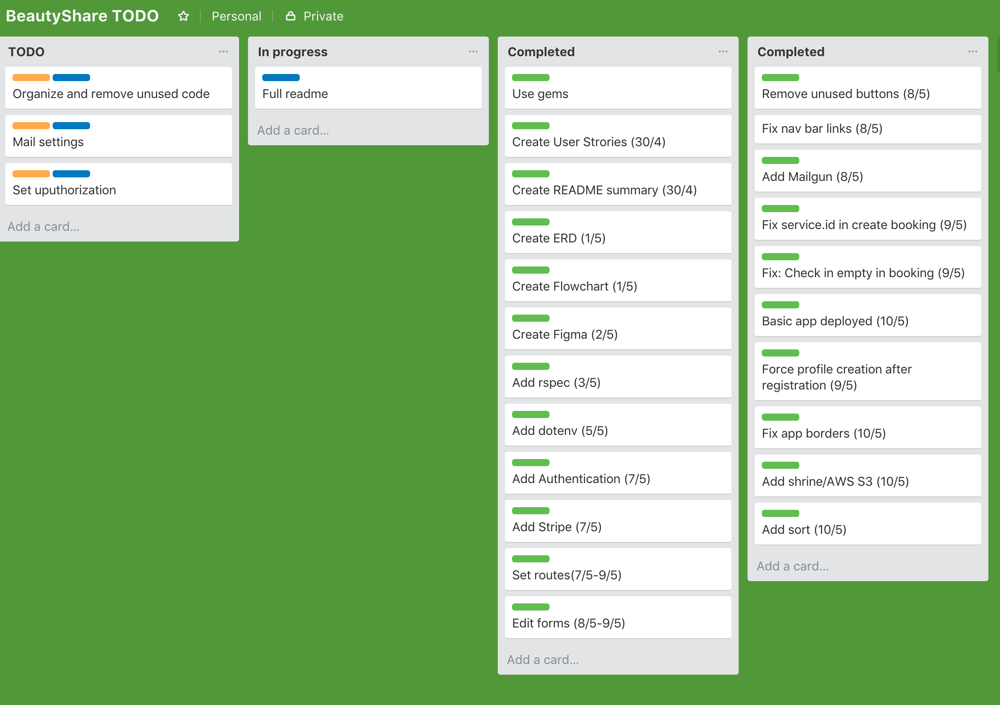

# README

A 10-days project to experiment on building a two-sided marketplace from scratch with rails and ruby gems. 
(no JS or html-css libs were used)

[Visit website here](https://beautyshare1.herokuapp.com/)

[Source code (github)](https://github.com/konpits/beautyshare)

## Outline

A platform that connects beauty consultants with beauty consumers. Through this platform, users can book sessions with beauty consultants and during these sessions, consultants offer their services, share their knowledge and cosmetic products discounts.

## Problem

People want to have a beautiful and healthy face. They use cosmetics and skin care products. They watch videos on how to do their makeup and how to treat their skin. They speak with hundreds of salespeople from various cosmetic brands or beauty salons. They consume a lot of information. However, if they want to get a personalized service, they have to visit a beauty store and speak to consultants of a specific brand. They are not able to use services from their online beauty mentors. 
On the other side beauty mentors can only have video channels, blogs and social media pages to promote their knowledge and showcase their products and techniques. If they want to physically approach real people they need to work for a specific cosmetics brand ar a beauty salon.

## Solution

People can use a platform to meet with their online beauty mentors, hire their services and use the products that they suggest. Beauty consultants can provide independent services that are not limited to specific brands and are objective and personalised to meet the individual needs. The outcome will be a community of people that share beauty tips and services, promote healthy and ethical products, promote natural beauty enhancement and warn people about possible negative aspects of some chemical products. Individuals should feel that they are in control of their look and their skin treatment in a way that is knowledgeable, affordable, sustainable and cruelty-free. 

## Design Process

Initially, I did some brainstorming to come up with some user stories that were essential for the design process.

[Visit Trello (User Stories) here](https://trello.com/b/ApC40hCt/beautyshare)

User Stories:

I designed the basic parts of the website on paper. Then I looked for inspiration online in regards to fonts, colours and images. Lastly, I searched for existing two-sided marketplace apps.

[Visit Figma (Wireframes) here](https://www.figma.com/file/C2lVa7DOijwB2Bptx6ATIl/BeautyShare)

Preliminary ideas and scheme:

I decided to go with a black and white colour palette as it looks like a great match for beauty content. I also chose two main fonts, "EB Garamond" and "Roboto Mono", because they compliment each other and seem to be a good match with the content as well. 

Settling on design and colour:

I made a generic flowchart to start thinking about basic functionality:

I followed a simple and straightforward approach for the database design:

I used Trello to keep track of my tasks
[Trello (backlog)](https://trello.com/b/zfCUviPc/beautyshare-todo)
[User Stories](./README_img/Trello_TODO.png)

Scrum board:

### Resources used
These are the main tools that I used in the process of making my portfolio website

* Figma
* Trello
* Rails documentation
* W3schools
* Codepen
* StackOverflow

### Future Enhancements
* A shopping cart for multiple service booking
* A messaging channel for users to communicate
* Review and rating system for consultants
* More service categories and more search/sort/filter functions
* Geolocation-Maps
* Improve security
* Add consultant availability
